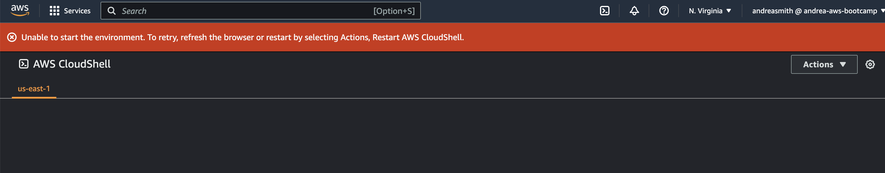

# Week 0 — Billing and Architecture

## Required Homework

### Install gitpod and AWS CLI
I was able to successfully use gitpod and install AWS CLI.

Here is the proof of working AWS CLI

### Conceptual and Architectual Diagrams
I then moved on to complete my conceptual and architectual diagrams.  The architectual diagram was a challenge as this is the first time I have completed a chart that is this complex.  I was able to follow the video in the playlist to get it done.  Please find the url's for my charts below
Conceptual Diagram url:
https://lucid.app/lucidchart/84594c13-0d8a-4a45-b205-48648ad839f7/edit?beaconFlowId=BA6F1530CD71436A&invitationId=inv_64c21381-d3a0-4935-aef8-2c39e983c7d4&page=0_0#
Architectural Diagram url:
https://lucid.app/lucidchart/ef65abd1-1773-433d-a57c-4a6cf0a67083/edit?beaconFlowId=E25E29E5E137DF5B&invitationId=inv_30ca4790-7c47-4df8-ba13-efddd44c1364&page=0_0#

### Admin user creation 
The next task was to create an admin user to avoid using root.  Here is the user created 'andreasmith'

### CloudShell Setup and Access attempts
I am having trouble accessing CloudShell.  I opened a case with Amazon and they have stated there is a 24 hour turn around.  Here is the screenshot of the case open.  If the case is resolved in time I will update the screenshot.  I have attached the screenshot from what happens when I try to access CloudShell.

### Generating of AWS Credentials
Generate AWS Credentials Proof

### Billing and budget alarms
Create Billing and Budget Alarm

## Homework Challenges
