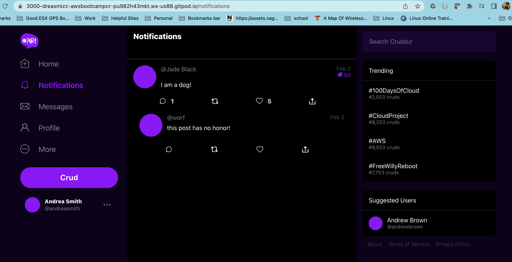
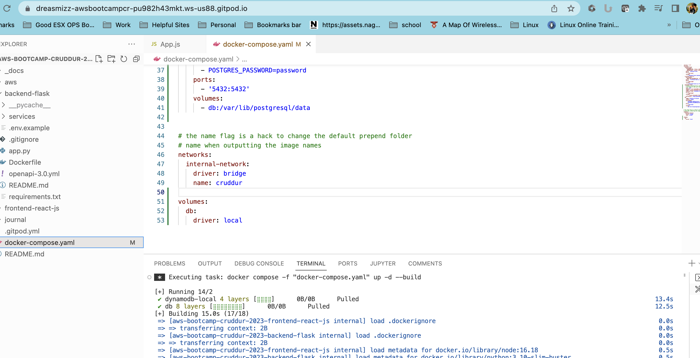
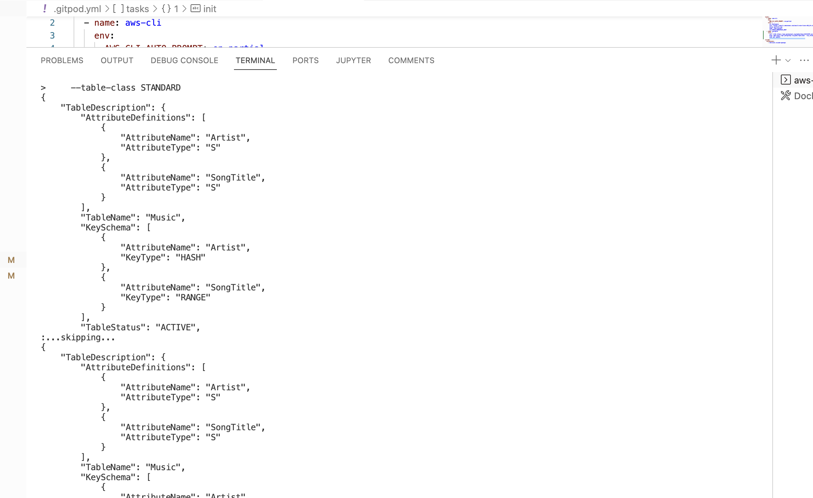
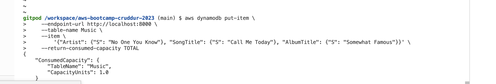
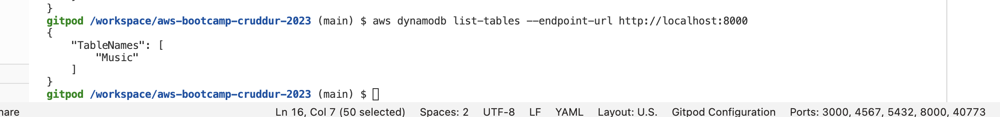
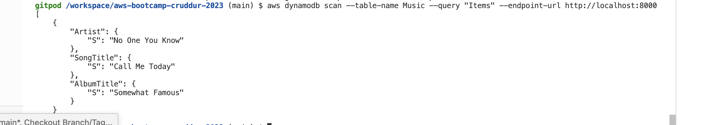
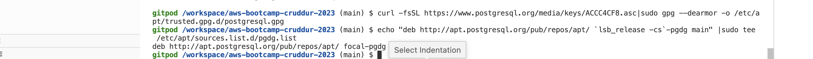
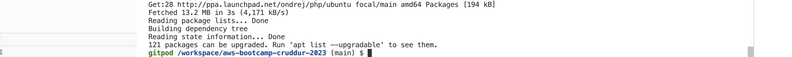
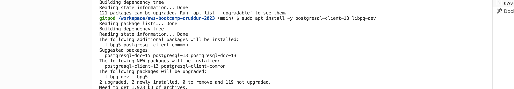

# Week 1 — App Containerization

## How to ask for help
I watched the how to ask for help video and found it very helpful.  I was stuck on an error all week with my notifications page and although I didn't have to ask for help in the discord I was able to navigate through and find a resolution.  It is very helpful if pages are spelled correctly if not you will get a 404 error that will drive you crazy for a few days.

## Notifications for Crudder application
I watched all videos pertaining to backend and front end notifications and was able to get my notifications page to successfully show.  Please see screenshot below.

## Run DynamoDB Local Container and ensure it works
I was able to get DynamoDB working.  Here are screenshots of the image pulling and working as expected.

## Postgres Install Proof
Here are the screenshots assciated with Postgres Install.  I was able to get it installed and working correctly.

## Database Connection setup
I was able to set up and connection via postgres

