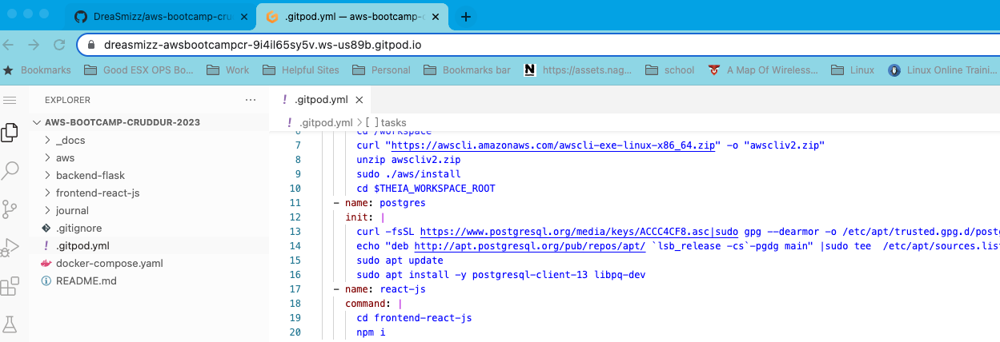
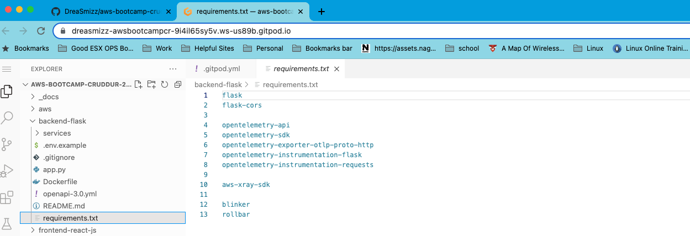
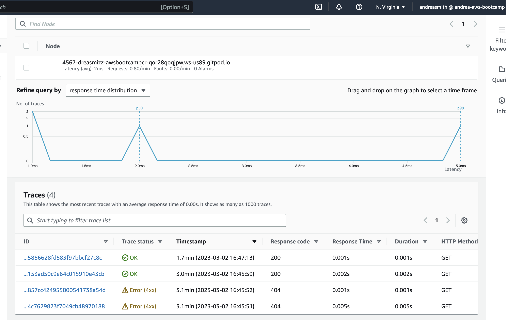
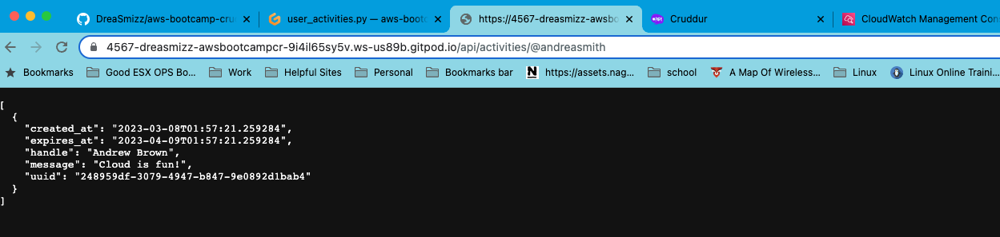
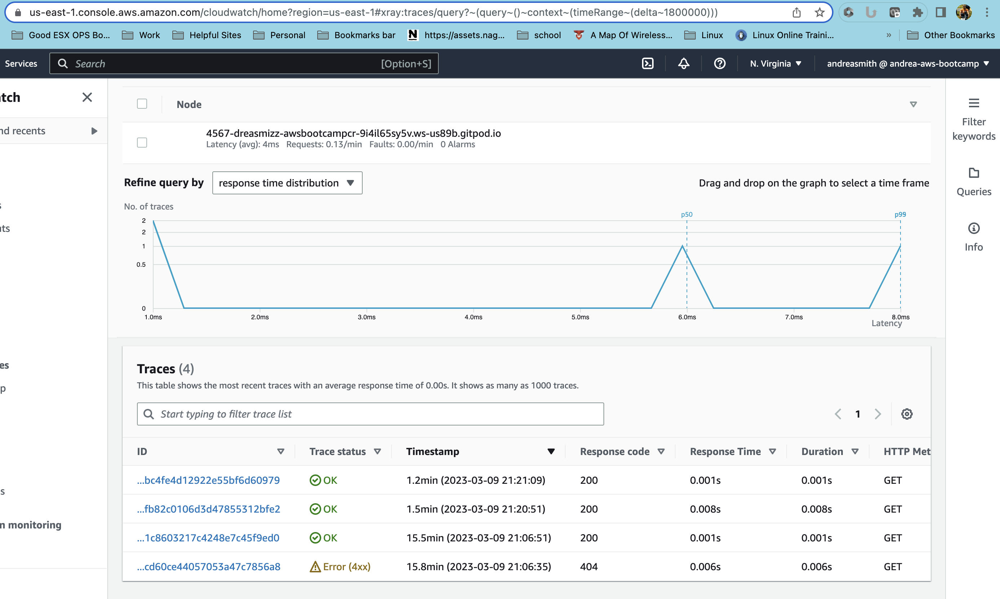
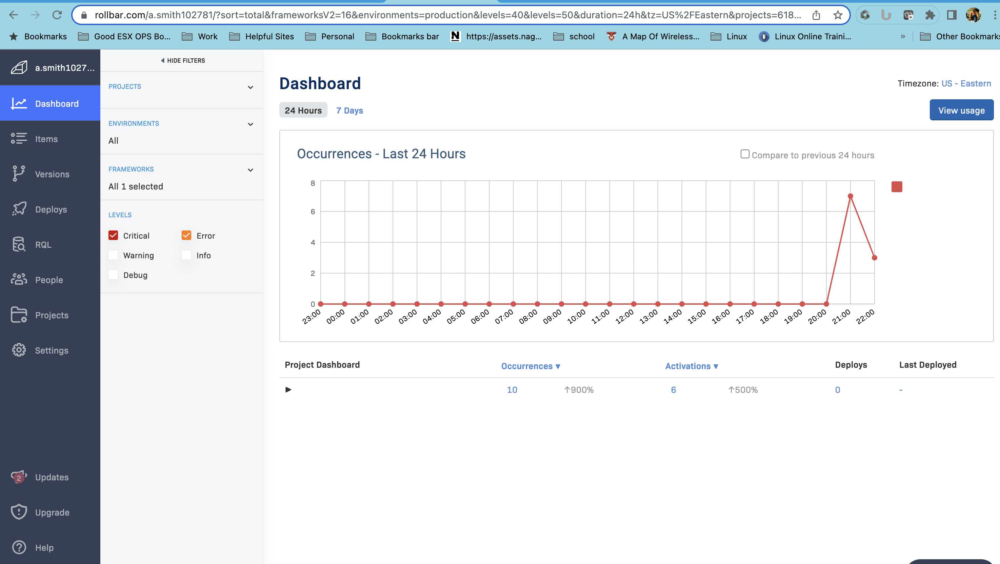
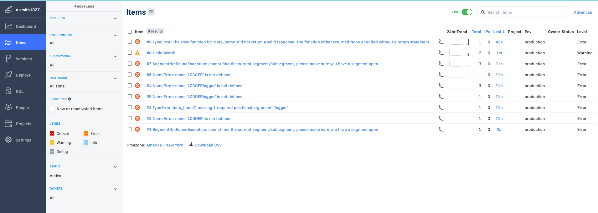

# Week 2 — Distributed Tracing

To save ourselves some time we updated our gitpod.yml file so that npm is automatically installed.

## X-Ray Implementation

Update of requirements.txt file to install xray.

I implemented x-ray so that we could see trace logs of activities on our site.  I was able to implement successfully, below screenshot shows traces.

I then took it a step further and implemented subsegments.  Here are the screenshots from that implementation.

## Rollbar
Here are the screenshots from Rollbar implementation and output along with the error we generated.

