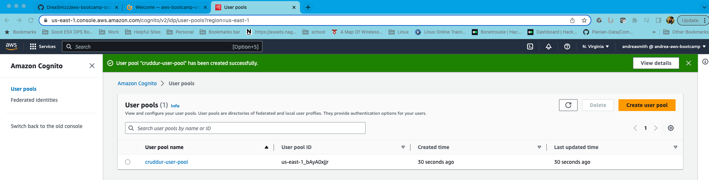

# Week 3 — Decentralized Authentication

## Setup Cognito User Pool
I was able to set up a user pool named crudder-user-pool by following the video.  Here is the snapshot of the created user pool.

## Implement Custom Signin Page

## Implement Custom Signup Page

## Implement Custom Confirmation Page

## Implement Custom Recovery Page

## Verify JWT Tokent Server Side

