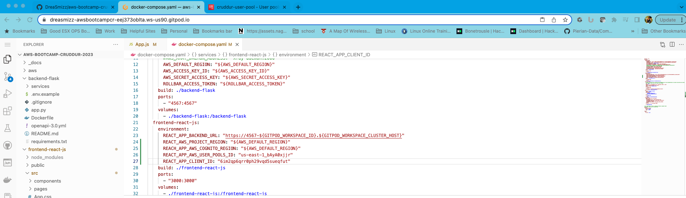

# Week 3 — Decentralized Authentication

## Setup Cognito User Pool
I was able to set up a user pool named crudder-user-pool by following the video.  Here is the snapshot of the created user pool.  

## Implement Custom Signin Page
Custom signin pages were added and tested to ensure accuracy.

## Implement Custom Signup Page

## Implement Custom Confirmation Page
After successfully verifying our user we also showed up in AWS as verified.

After successfully performing sign up verification we were able to sign in and show our preferred user name

## Implement Custom Recovery Page
We also tested the portion of the site required if someone needed to recover/update their password due to forgetting it.  Here are the screenshots associated with that.

## Verify JWT Tokent Server Side

